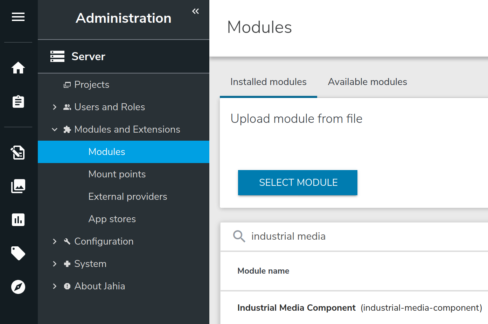

# Industrial Media Component
 This module contains media samples formated for the *[Industrial Template Set][industrial:url]*.
 
 The module deploys in Jahia jContent a set of images and video. Then, these media assets can be used in any
 Jahia website. The format of the images is specifically designed to fit with the industrial template set.

## Quick Start

### Install the module

#### From the source
1. Download the zip archive of the latest release.
2. Go to the root of the repository.
1. Run the command `mvn clean install`. This create a jar file in the *target* repository.
    > you must have a **java sdk** and **maven** installed
1. In jContent, go to `Administration` panel.
1. In the `Server` section expand the `Modules and Extensions` entry and click `Modules`.
1. From the right panel, click `SELECT MODULE` and select the jar file in the *target* repository.
1. Finaly click `UPLOAD`.

#### From the store
1. In jContent, go to `Administration` panel.
2. In the `Server` section expand the `Modules and Extensions` entry and click `Modules`.
3. From the right panel, click `Available modules` and search for **industrial media**.

    <!--![205]-->
    
4. Click the icon ![201] in the right of the package to download and install the module  
  
  in the jContent repository as presented in
 the image below.
 
### Use the module in existing website
1. In jContent, go to `Administration` panel.
1. In the `Server` section expand the `Modules and Extensions` entry and click `Modules`.
1. From the right panel, search for **industrial media** and click on the module.

    

1. In the bottom of the page select you website and click the switch button.

    ![300]
    
    >jContent needs few seconds to deploy and register the media contents into the JCR.    
1. Now you should see a new **media** folder into the  `jContent/Media` tabs.

    ![303]

1. You can browse the tree to discover the content.

    ![304]
    
[201]: ./doc/images/201_modules_download_icon.png
[300]: ./doc/images/300_enable_onsite.png
[301]: ./doc/images/301_search_module.png
[303]: ./doc/images/303_media_folder.png
[304]: ./doc/images/304_jahia_gallery.png
[industrial:url]:https://github.com/hduchesne/industrial